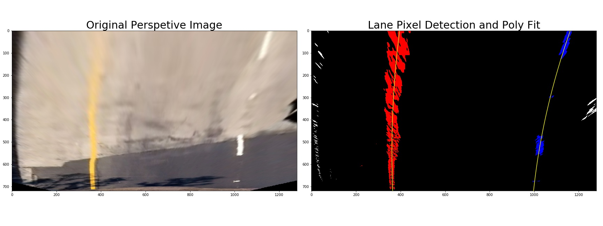
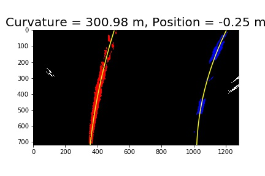

## Advanced Lane Finding
[](http://www.udacity.com/drive)

---
The goals / steps of this project are the following:

1. Compute the camera calibration matrix and distortion coefficients given a set of chessboard images. (`1_calibration_camera_chessboard.jpg`)
2. Apply a distortion correction to raw images. (`2_undist.jpg`)
3. Use color transforms, gradients, etc., to create a thresholded binary image. (`3_masking.jpg`)
4. Apply a perspective transform to rectify binary image ("birds-eye view"). (`4_warp.jpg`)
5. Detect lane pixels and fit to find the lane boundary. (`5_lane_pixel_fit.jpg`)
6. Determine the curvature of the lane and vehicle position with respect to center. (`6_curvature.jpg`)
7. Warp the detected lane boundaries back onto the original image. (`7_warp_back.jpg`)
8. Output visual display of the lane boundaries and numerical estimation of lane curvature and vehicle position.

Each step has its corresponding output image (`*.jpg`) stored in directory `output_images/`

---
### [Rubric](https://review.udacity.com/#!/rubrics/571/view) Points
#### 1. Camera calibration
The images for calculating the distortion and 3-D to 2-D mapping matrix are stored in `./camera_cal/calibration*.jpg`.
Firstly, I used `cv2.findChessboardCorners` to find out all those corner points (`corners`) in the images.
Then I used `cv2.calibrateCamera` to calculate the distortion (`dist`) and mapping matrix (`mtx`) given the `corners` pts and their corresponding predifined 3-D pts `objp`


#### 2. Provide an example of a distortion-corrected image
Here is an example of distortion-corrected image:


#### 3. Create a thresholded binary image and provide example
I used magnitude of gradients, direction of gradients, and L and S in HLS color space.
A combined rule is used:

```python
combined[((mag_binary == 1) & (dir_binary == 1)) |\
         ((hls_binary == 1) & (dir_binary == 1) & (bright_binary == 1))] = 1
```

Example masking image is showed:


Moreover, I used widgets to help tunning the parameters of those masking functions. It can provide instantaneous binary result that really help for accelarating this step. The widgets codes are list here:

```python
def interactive_mask(ksize, mag_low, mag_high, dir_low, dir_high, hls_low, hls_high, bright_low, bright_high):
    combined = combined_binary_mask(image,ksize, mag_low, mag_high, dir_low, dir_high,\
                                    hls_low, hls_high, bright_low, bright_high)
    plt.figure(figsize=(10,10))
    plt.imshow(combined,cmap='gray')
    
interact(interactive_mask, ksize=(1,31,2), mag_low=(0,255), mag_high=(0,255),\
         dir_low=(0, np.pi/2), dir_high=(0, np.pi/2), hls_low=(0,255),\
         hls_high=(0,255), bright_low=(0,255), bright_high=(0,255))
```


#### 4. Perspective transform
First, I defined the source and destination of perspective points as follows:

| Source        | Destination   | 
|:-------------:|:-------------:| 
| 585, 460      | 320, 0        | 
| 203, 720      | 320, 720      |
| 1127, 720     | 960, 720      |
| 695, 460      | 960, 0        |

Then the `perspective_warper` function is defined which returns perspective image and the matrix `warpM` as well.
`warM` is needed for the later step which does the *inverse perspective* back to the original image.

```python
perspective_img, warpM = perspective_warper(undist,src,dst)
```

An example is showed here:


#### 5. Lane line pixel and polynomial fitting



#### 6. Radius of curvature of the lane and the position of the vehicle



#### 7. Warp the detected lane boundaries back onto the original image


#### 8. Video

Please see the `project_video_out.mp4` in this repository.

### Discussion

to be continue ...
